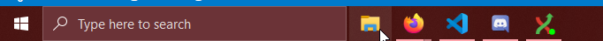

## Lesson 1.1: Acquiring Software

*Git* is the name of the tool we use to move software between *Github*'s servers and our development computers.

As a one-time, first step, we will use the `clone` operation to do a first-time acquisition of software from github. 

Later, we will use other commands to `push` and `pull` changes from our local `repository` of software.

Perform the following steps:

1. Open the *Windows file explorer* 

2. Create the folder `C:\Users\<username>\SwDev\`, if it does not yet exist. Open that folder in the file browser. 

 If you're new to this sort of thing... 

Here's one set of steps to accomplish that:

Select the `C:\` drive:

Select the `Users` folder, followed by your username:

Right Click in the empty space, hover over `New`, and make a new folder:

Type in the approprate name for the new folder:

3. Right click in the empty space in the folder to get the context menu, and select `GitExt Clone`.

4. Paste the following web address into the top "Repository to clone" box: `https://github.com/RobotCasserole1736/OffseasonTraining`

5. All other default options are fine. Click the `Clone` button.

You may be prompted for your github username and password - enter it if needed.

Afterward, you should see a new folder named `OffseasonTraining`.

Huzzah! You now have some software on your computer. You are ready to add your own functionality to the code.

