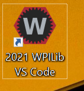
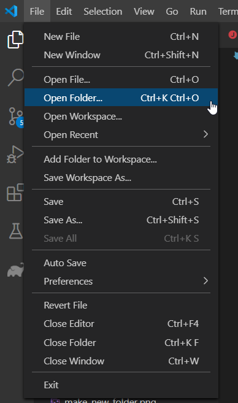
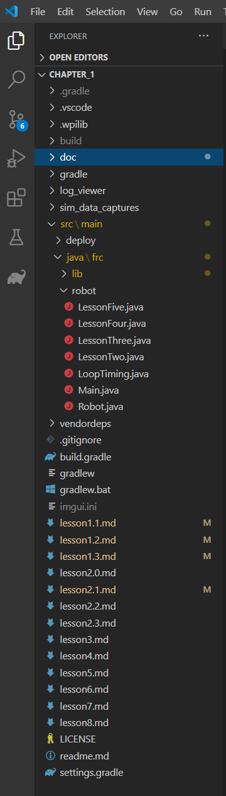
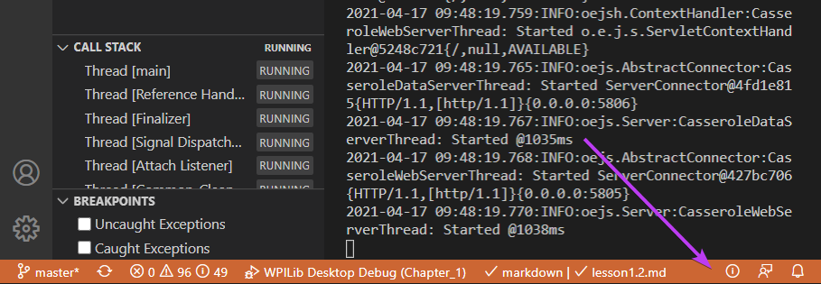
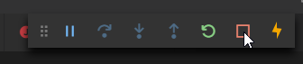

# Lesson 1.2: Running Software

## Opening and Viewing Code Files

Open VSCode by double-clicking the desktop icon. 

In the `File` menu, select `Open Folder`, then navigate and select the folder `C:\Users\<userid>\SwDev\OffseasonTraining\Chapter_1`. 

You should now see some files in the left hand side. The little `>` and `v` carats can be clicked to show or hide the content of each folder.

Click through the `src`, then `main`, then `java`, then `frc`, then `robot` folders to find the core of the code we'll be editing and changing. 

Double click the `Robot.java` file to open it. 

## Running Software in Simulation

Hit the `F5` key on the top row of your keyboard. The build will start.

After the build has finished, you will get a prompt about using different sim extensions. Check the `halsim_gui.dll` box, and hit OK.

As the robot code starts up, you'll text appear in the `Terminal` window. Note one line in particular:

Note how that line of text output matches with this line of code:

That `System.out.println("Some text goes here!");` code will put messages into the terminal output, and is a very useful way to understand what order different pieces of code happen in.

Additionally, you should notice the blue bar at the bottom of Visual Studio Code change color to orange.

Finally, while running on your computer, there's a special GUI used for controlling the simulation.

Select the red square "stop" button at the top of the code editor window at any time to stop your code.

