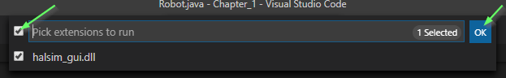
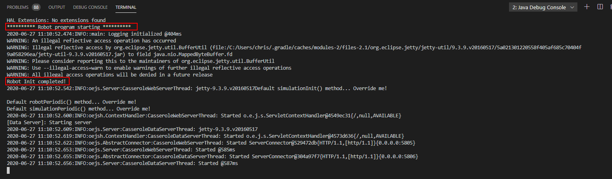
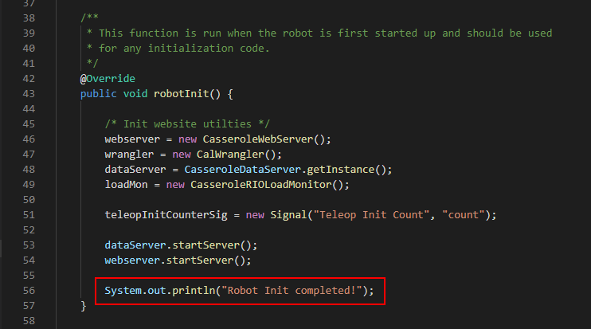

### Lession 1.2: Running Software

Before making changes to any software that allready exists, you should generally check that it is working and functional, and familiarize yourself with its contents. That's what we'll do now.

To start, we'll need to open *Visual Studio Code* (or, *VSCode*). This is the tool we will use to modify, run, and test our software. It's one of many tools that can do it, but happens to be the "offically supported" one for FRC. So we use it.

Start VSCode by double-clicking the desktop icon. 

You should be greeted with a basic user interface. You'll want to go open the folder containing the code we just got from Github.

In the `File` menu, select `Open Folder`, then navigate and select the folder `C:\Users\<userid>\SwDev\OffseasonTraining\Chapter_1`. 

You should now see some files in the left hand side. It's just showing you the folders and files that are on your hard drive, in that folder we selected. You can click through the `src`, then `main`, then `java`, then `frc`, then `robot` folders to find the core of the code we'll be editing and changing. The other folders have useful content too, but we can ignore them for now. 

Double click the `Robot.java` file to open it. This is the "entry-point" file - the first file that runs from the code that we write for the robot. A lot of the code writing will happen in this file. Glance through it, notice how it has different chunks of code for `Init`, `Teleop`, and `Autonomous`. It's actually fairly empty right now, we'll be filling content later to define the robot's behavior during `Init`, `Teleop`, and `Autonomous` operation.

All code we write could be run in two places: One is on the desktop/laptop computer you are using right now. The other is on the roboRIO, the "controller" computer which is on the robot.

Running code on your own computer is very useful for testing that the code has some functionality before taking it to the robot. There are a number of reasons for this:

1. We only have one robot, but many laptops.
2. The robot will move. Running into people hurts. We want to ensure our code will work properly before risking damage to people or things.
3. Problems are generally easier to solve on a laptop computer.

We will now attempt to run the code on our desktop computer.

Hit the `F5` key on your keyboard. This should start a sequence of events where the computer takes your source code files and turns them into a `.jar` file, which it attempts to run. This is where you might see some errors if you've written code that the computer can't understand. However, since we haven't changed anything yet, the code should compile without error.

You may get a prompt about using `halsim_gui.dll` - that's ok, check all boxes and hit OK.

As the robot code starts up, you'll see some text start to barf to the `Terminal` window. This is expected and normal. Each line has some meaning, but don't worry too much about understanding each of them now. Do note one line in particular:

Note how the contents of the line matches with this line of code:

That `System.out.println("Your message here!");` code will put messages into the terminal output, and is a very useful way to understand what order different pieces of code happen in.

At this point, your robot code is running in the background on your computer! Congradulations!