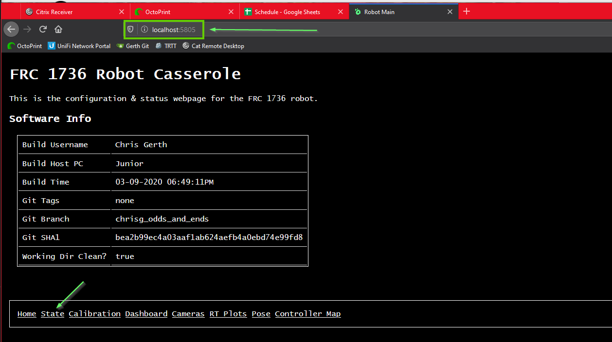
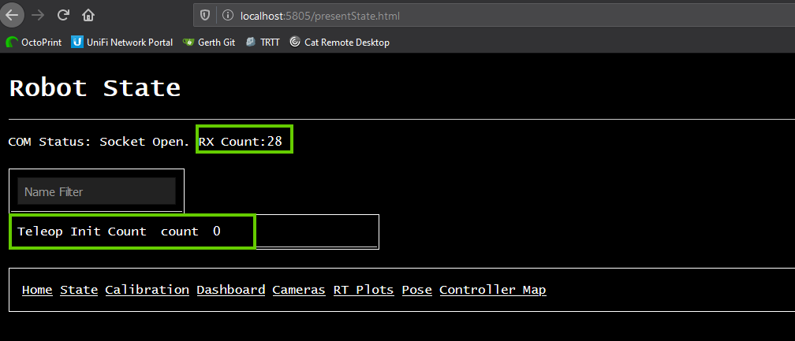
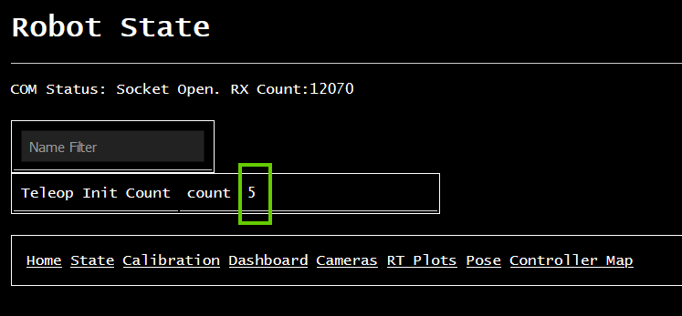
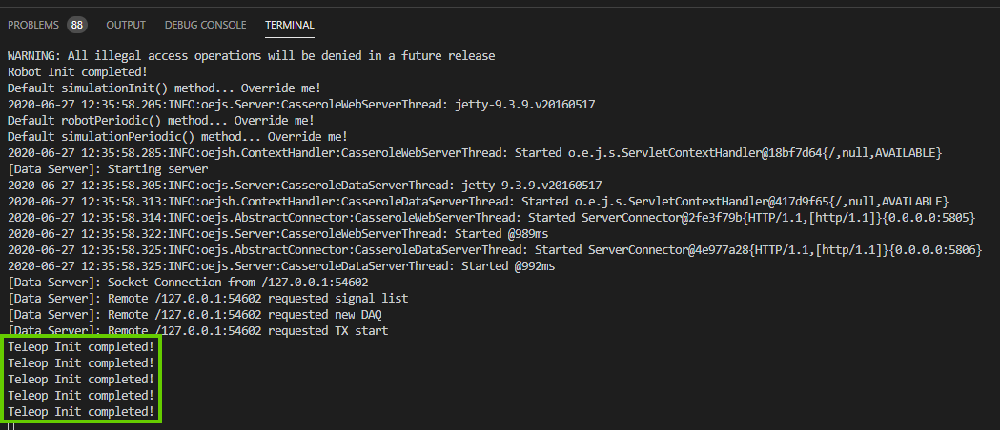
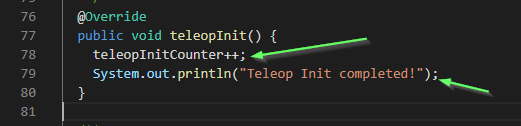
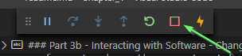
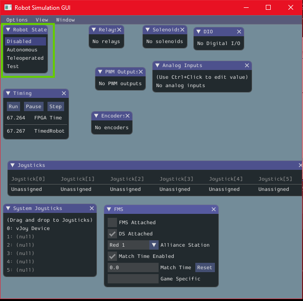

# Lesson 1.3: Interacting with Robot Code

## Robot Website

Our software produces a *website* we can view and use to interact with the software.

Open a web browser (Chrome or similar) and go to `http://localhost:5805`. You should be presented with a basic interface like this:

Click the `State` link, and you should see another webpage. 

Two things to note:

1. The RX Count should be ticking up fairly quickly. This means that the webpage is getting data updates from the robot! Good!
2. There is a variable for counting the number of times we've called `telopInit()`, marked to be a `@Signal`.

We'll come back to this soon.

You can click through the other pages too if you want, though there's not much there now. That'll change soon enough!

## Changing Robot State

Go ahead and open the `State` page on the robot website, and bring up the Robot Simulation GUI so you can see both at the same time. 

In the Simulation GUI, Click the Robot State to `Teleoperated`, then back to `Disabled`. Do that a few times.

Notice that every time you click to `Teleoperated`, the `Teleop Init Count` should increase by one. 

You may also notice, when you click `Teleoperated`, in the *Terminal* in VSCode, a new thing is printed every time:

Why do both these things happen? Well, there's a lot of reasons. But the core that we care about right now: _there are lines of code in Robot.java that drive it_.

Let's look at this hunk of the code, which happens to run once every time we start operation in `Teleoperated` mode:

The first line: `teleopInitCounter++;` - this ticks up the value in the "Teleop Init Counter" by 1. Every time this code runs, that `++` operator makes the value inside of the variable `teleopInitCounter` _increment_, or increase by one. The second line is like what we saw before: `System.out.println()` code injects custom messages into the Terminal.

Don't worry too much if that doesn't make much sense now, we'll dig into it more later. But the key connection to make for now: The website is displaying numbers and data that come from our code. Because of this, we can use the website to understand how our code is working. This is important, because it's the tool that is used to determine whether the code is working like we want it to - both on and off the robot!

That's all for today. When you're done exploring, you can stop the code by clicking the stop button at the top of VS Code:

## Simulation GUI

Obviously, there's no robot that the software is controlling, but we can still interact with it. 

The first thing is a blue-and-grey GUI that pops up when the simulation starts. This is the _Input/Output Simulator_. Since we don't have all the real wires on a roboRIO, we use this GUI interface to simulate what the data on those wires would be. 

We won't worry about all the details now, but note in particular the *Robot State* widget. This is the fundamental mode-switcher on the robot. Robots have three primary modes:

1. Disabled - not moving and safe to handle
2. Autonomous - Robot makes its own decisions and movements without a driver's input. AKA *Auto*.
3. Teleoperated - Robot drives around under the control of human operators. AKA *Teleop*.

During competition, the *Driver Station Software* and the *Field Management System* enable and disable robots automatically during the match. For our testing, we will manually change the robot's state via that *Robot State* widget.

