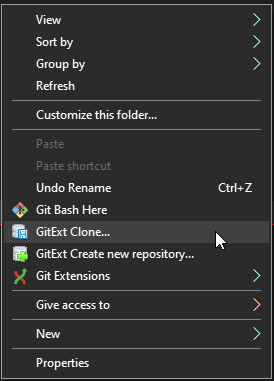

## Lesson 1 - Getting Started

Welcome to the wonderful world of writing code for robots!

### Prerequisites

Before starting, ensure you have completed all necessary software install processes. Talk to mentors or returning students for info about this.

Additionally, ensure you have a github account which is associated with the team. Ask mentors or returning students for help on this. Be sure to have your github username and password available and ready to use.

### Part 1 - Acquiring Software

More than likely, you're reading this online, in a web browser now. You can click around to see other files, make small modifications. This is a very nice feature of *Github*, the website where we we keep our software.

However, to run the code, and make bigger changes, you'll want the software on your computer.

*Git* is the name of the tool we use to move software between *Github*'s servers and our development computers.

As a one-time, first step, we will use the `clone` operation to do a first-time acquisition of software from github. Later, we will use other commands to `push` and `pull` changes from our local `repository` of software.

Motivation: In a team-based software development environment, you rarely start writing all your code from sractch (in fact, exactly one student does this once per build season). More frequrently, you are starting your development _based on_ the work someone else already did. You take their content, modify it, add your own things, and submit it back for the next person to work on. Multiply this by 10+ people, and you've got a team developing a singular codebase! THe reason we need tools like Git and Github are to ensure that all people can contribute their changes without "stepping" on each other, using different computers. It additionaly ensures that, as a team, we have a singluar notion of what the "correct" or "most recent" software is. All of this is key to ensuring the software we provide is high-quality, and defect-free.

Perform the following steps:

1. Open a windows file browser
2. Create the folder `C:\Users\<userid>\SwDev\`, if it does not yet exist. Open that folder in the file browser.
3. Right click in the white space in the folder to get the context menu, and select `GitExt Clone`.

4. Paste the following *URL* into the top "Repository to clone" box: `https://github.com/RobotCasserole1736/OffseasonTraining`
5. All other default options are fine. Click the `Clone` button.

You may be prompted for your github username and password - enter it if needed.

Afterward, you should see a new folder named `OffseasonTraining`.

Congradulations, you now have some software on your computer, which you can begin to edit.

### Part 2 - Running Software

Before making changes to any software that allready exists, you should generally check that it is working and functional, and familiarize yourself with its contents. That's what we'll do now.

To start, we'll need to open *Visual Studio Code* (or, *VSCode*). This is the tool we will use to modify, run, and test our software. It's one of many tools that can do it, but happens to be the "offically supported" one for FRC. So we use it.

Start VSCode by double-clicking the desktop icon. 

You should be greeted with a basic user interface. You'll want to go open the folder containing the code we just got from Github.

In the `File` menu, select `Open Folder`, then navigate and select the folder `C:\Users\<userid>\SwDev\OffseasonTraining\Chapter_1`. 

You should now see some files in the left hand side. It's just showing you the folders and files that are on your hard drive, in that folder we selected. You can click through the `src`, then `main`, then `java`, then `frc`, then `robot` folders to find the core of the code we'll be editing and changing. The other folders have useful content too, but we can ignore them for now. 

Double click the `Robot.java` file to open it. This is the "entry-point" file - the first file that runs from the code that we write for the robot. A lot of the code writing will happen in this file. Glance through it, notice how it has different chunks of code for `Init`, `Teleop`, and `Autonomous`. It's actually fairly empty right now, we'll be filling content later to define the robot's behavior during `Init`, `Teleop`, and `Autonomous` operation.

All code we write could be run in two places: One is on the desktop/laptop computer you are using right now. The other is on the roboRIO, the "controller" computer which is on the robot.

Running code on your own computer is very useful for testing that the code has some functionality before taking it to the robot. There are a number of reasons for this:

1. We only have one robot, but many laptops.
2. The robot will move. Running into people hurts. We want to ensure our code will work properly before risking damage to people or things.
3. Problems are generally easier to solve on a laptop computer.

We will now attempt to run the code on our desktop computer.

Hit the `F5` key on your keyboard. This should start a sequence of events where the computer takes your source code files and turns them into a `.jar` file, which it attempts to run. This is where you might see some errors if you've written code that the computer can't understand. However, since we haven't changed anything yet, the code should compile without error.

You may get a prompt about using `halsim_gui.dll` - that's ok, check all boxes and hit OK.

As the robot code starts up, you'll see some text start to barf to the `Terminal` window. This is expected and normal. Each line has some meaning, but don't worry too much about understanding each of them now. Do note one line in particular:

Note how the contents of the line matches with this line of code:

That `System.out.println("Your message here!");` code will put messages into the terminal output, and is a very useful way to understand what order different pieces of code happen in.

At this point, your robot code is running in the background on your computer! Congradulations!

### Part 3a - Interacting with Software - Simulation GUI

Obviously, there's no robot that the software is controlling, but we can still interact with it. 

The first thing is a blue-and-grey GUI that pops up when the simulation starts. This is the _Input/Output Simulator_. Since we don't have all the real wires on a roboRIO, we use this GUI interface to simulate what the data on those wires would be. 

We won't worry about all the details now, but note in particular the *Robot State* widget. This is the fundamental mode-switcher on the robot. Robots have three primary modes:

1. Disabled - not moving and safe to handle
2. Autonomous - Robot makes its own decisions and movements without a driver's input. AKA *Auto*.
3. Teleoperated - Robot drives around under the control of human operators. AKA *Teleop*.

During competition, the *Driver Station Software* and the *Field Management System* enable and disable robots automatically during the match. For our testing, we will manually change the robot's state via that *Robot State* widget.

### Part 3b - Interacting with Software - Robot Website

Additionally, both on the robot and on your local computer, the software produces a *website* we can view and use to interact with the software.

Open a web browser (Chrome or similar) and go to `http://localhost:5805`. You should be presented with a basic interface like this:

Click the `State` link, and you should see another webpage. Two things to note:

1. The RX Count should be ticking up fairly quickly. This means that the webpage is getting data updates from the robot! Good!
2. There is a variable for counting the number of times we've called `telopInit()`, marked to be a `@Signal`.

We'll come back to this soon.

You can click through the other pages too if you want, though there's not much there now. That'll change soon enough!

### Part 3b - Interacting with Software - Changing Robot State

Go ahead and open the `State` page on the robot website, and gring up the Robot Simulation GUI so you can see both at the same time. 

In the Simulation GUI, Click the Robot State to `Teleoperated`, then back to `Disabled`. Do that a few times.

Notice that every time you click to `Teleoperated`, the `Teleop Init Count` should increase by one. 

You may also notice, when you click `Teleoperated`, in the *Terminal* in VSCode, a new thing is printed every time:

Why do both these things happen? Well, there's a lot of reasons. But the core that we care about right now: _there are lines of code in Robot.java that drive it_.

Let's look at this hunk of the code, which happens to run once every time we start operation in `Teleoperated` mode:

The first line: `teleopInitCounter++;` - this ticks up the value in the "Teleop Init Counter" by 1. Every time this code runs, that `++` operator makes the value inside of the variable `teleopInitCounter` _incriment_, or increase by one. The second line is like what we saw before: `System.out.println()` code injects custom messages into the Terminal.

Don't worry too much if that doesn't make much sense now, we'll dig into it more later. But the key connection to make for now: The website is displaying numbers and data that come from our code. Because of this, we can use the website to understand how our code is working. This is important, because it's the tool that is used to determine whether the code is working like we want it to - both on and off the robot!

That's all for today. When you're done exploring, you can stop the code by clicking the stop button at the top of VS Code:

