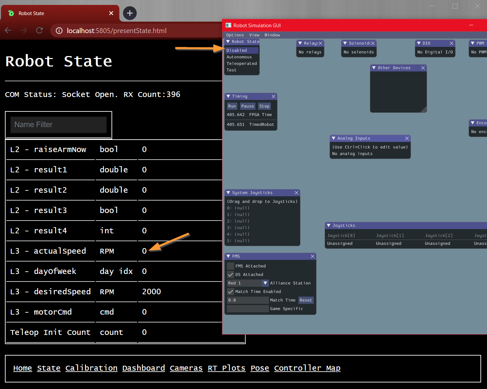
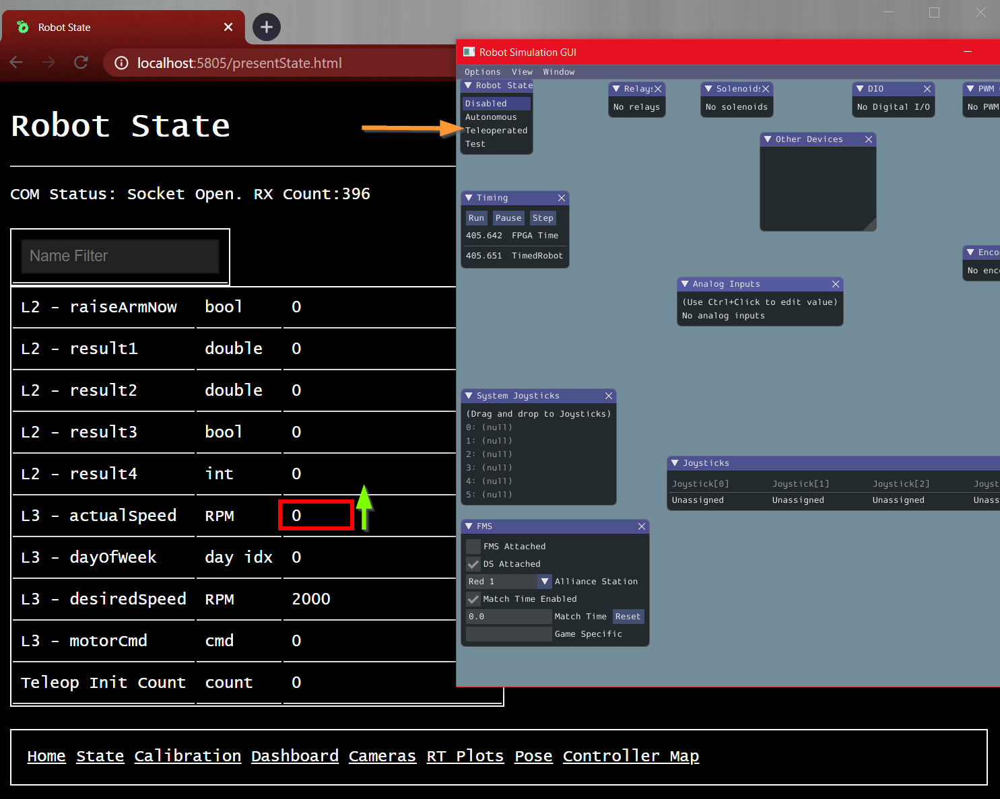

## Lesson 3

## Some Thoughts Before We Start

Welcome back! Hopefully you've found our first few lessons informative, perhaps even enjoyable! These rudiments are always the hardest thing to slog through, because the so frequently seem abstract and disconnected from how robots actually work. Fear not, we'll be getting closer to that soon enough here.

You may also notice a lot of these word problems are _poorly written_. There's extra info in them you might not need, and there's vagueness where you either have to make assumptions or ask questions. 

This is intentional. For better or worse, the real world is not as well-defined as we'd like it to be. When designing a robot and writing software for it, we're gonna get blasted with information - some of which we need, some of which we don't. We're also going to be missing large pieces of information, which we'll either have to assume or go ask about. This is all just the normal design and development process - not something to be feared, but rather embraced!

The good news is that lots of folks on the team do this for their job, and have built many robots before. Lean on them for their experience! Ask questions fearlessly, and seek to learn _how to learn_. 

## Comparison - Creating Booleans

Booleans can be created by comparing two `double`'s or two `int`'s.

`A == B` returns true if A and B are exactly the same, false otherwise.

`A <= B` returns true if A is less than or the same as B, false otherwise.

`A < B` returns true if A is less than B, false otherwise.

`>` and `>=` do exactly what you'd expect them to.

Note the subtle difference between `=` and `==` - it's a common mistake to mix them up. THe way to remember: `=` assigns, `==` compares. It's just something to memorize. 

### Comparison Example

To illustrate the usage, consider the following problem:

Create a boolean named `shooterRunning` which is `True` when the shooter wheel is spinning fast enough, and false otherwise.

Critical to this, we have to define the speed at which we are running "fast enough". This number should come from the mechanical team that's prototyping the shooter. It might be verified by software team doing empirical testing on the final robot. Regardless, we'd create a variable to describe it:

`final double SHOOTER_RUNNING_RPM = 3200.0;`

NOTE: The ALL_CAPITAL_LETTERS format and presence of `final` indicates this is a _constant_ number. It's a promise to the roboRIO that we'll never change the numerical value of `SHOOTER_RUNNING_RPM` - it's a _constant_ value.

Assume we have some measurement of shooter speed stored into the variable `shooterSpeed_RPM`. We can create our boolean:

`shooterRunning = (shooterSpeed_RPM >= SHOOTER_RUNNING_RPM);`

This will meet our requirement: `True` when the shooter is "up to speed", `False` otherwise.

## `if` - `else if` - `else` Statements

Recall that java code is organized into "blocks", using the `{` and `}` characters.

```java
{
    //This is a block of code
}

{ 
    //This is a different block of code.
}
```

You can use "if-statements" to _control whether a block of code is executed or skipped_.

This is a very powerful concept: if/else allows you to use booleans to "turn on" or "turn off" certain code from executing. This is the basic mechanism for pieces of software to "make decisions" between alternatives.

The sequence must always be:

1) `if(<condition>)`
2) `else if(<condition>)` (optional)
3) `else` (optional)

Each `<condition>` must be (eventually) a boolean. Whether this is explicitly some `boolean` variable, or just a boolean created by comparison of two `int` or `double` values... doesn't quite matter. All that matters is that the thing inside the `()` can be interpreted as a `boolean`.

Note that both the `else if` and `else` statements are technically optional. You may or may not need them, depending on your situation.

Additionally, you may have as many `else if` statements as you want. Anywhere between 0 and infinity (actually, as many as your PC's memory will allow ... which is "a lot". ).

The blocks of code are always evaluated top-down. FIrst, the first `if` statement is checked. If its `<condition>` is `True`, its code block is run, and all the others are skipped. 

If the first statement's `<condition>` is `False`, it is skipped, and execution goes to the next `else if(<condition>)`. If _that_ one's `<condition>` is true, it is run. Otherwise, execution moves on to the next `else if(<condition>)`.

Finally, if there is an `else` statement and no prior `<condition>` has returned `True`, the `else` block is run.

Here's an example of the syntax:

```java

boolean cond1 = False;
boolean cond2 = True;

if(cond1){
    System.out.println("Ran IF");
} else if (cond2) {
    System.out.println("Ran ELSE IF");
} else {
    System.out.println("Ran ELSE");
}
```

Try putting this code into the `LessonThree.java` file's `updateLessonThree()` method, and run it.

Which output do you expect to run?

NOTE: Answer is "Ran ELSE IF". This is because of the following: `cond1` is `False`, so the first statement is skipped. However, `cond2` is `True`, so it's code block gets run. Finally, since the `else if`'s block got run, there is no need to do the default `else` block.

## Problem 1 - Days of the Week

The variable `dayStr` is a _String_, which contains three letters representing the day of the week. Or, rather, an abbreviation of it.

NOTE: A "String" is a sequence of characters, representing some word or sentence. They don't get used much in robot code, so we won't dig too deeply into them here. This exercise will help you briefly discover them.

Write a set of if/else-if/else statements to convert dayStr into an integer "day of week index".  The first day of the week is 0, the last day of the week will be 6. The transformation should be:

```
"Sun" = 0
"Mon" = 1
"Tue" = 2
"Wed" = 3
"Thr" = 4
"Fri" = 5
"Sat" = 6
```

Store the result of your calculation into the variable `dayOfWeek`.

To check if two strings are equal, use the `==` sign as usual. For example, the expression `myStrVar == "test"` will return `True` if the value of `myStrVar` is exactly `test`, and false for any other string (including `Test`, `testy`, `tasty`, `rusty`, or really anything else you could think of).

Look at the initial value for `dayStr` - what do you expect `dayOfWeek` to get set to?

Run your code, visit the website, and see the result. Try different values for `dayStr` and re-run the code. Confirm the results always match your expectations.

## Problem 2 - Right Triangles

We're going to do some basic geometry for this problem. For those of you who haven't taken geometry yet, there's just a few facts to know:

1) A triangle always has 3 sides, and 3 angles.
2) A "right" triangle has one angle which measures exactly 90 degrees.
3) Assuming the length of the sides of the triangle are variables A, B, and C - you can determine if a triangle is "right" or not by checking the following three facts are true:
    1) All sides are longer than 0.
    2) Side C is longer than both A and B
    3) The _square_ of side C's length equals the square of A's length, plus the square of B's length. (IE, `C^2 = A^2 + B^2`). 

Given these three integer inputs:

```java
int ASideLen
int BSideLen
int CSideLen
```

Write code that prints out "It's a right triangle!" when the three side lengths meet the properties above for being a "right" triangle. Don't print anything extra for when it's not a right triangle.

Look at the initial values for the A/B/C Side Lengths'. Do you expect 3/4/5 to be a right triangle?

Run your code and see if the print out in the console window matches your expectations. 

Change the initial values for A/B/C Side Lengths and try again. Test with your own inputs as you like. 

Using your code: is 0/0/0 a right triangle? is 3/4/6 a right triangle?

## Problem 3 - "Bang Bang" Shooter Wheel Control

We're going to introduce a few new concepts here to tie `if/else` statements back to robot design. If you're new, this will probably be a bit of a "firehose" of facts tossed at you. Fear not, understanding the fine details of "why" these facts are isn't important for this problem. We're just going to introduce the facts and let you use them to solve a problem. Later in the season, we'll wrap back around to the "why". But for now, just memorize them.

Generally, when shooting a ball into a goal or target, we will launch it using a rubber wheel. Very much like one of those baseball or softball pitching machines.


To shoot the ball consistently and accurately, one key is to ensure the shooter wheel is running at a constant _speed_. 

There are sensors which can measure the wheel's _actual_ speed (usually in units "revolutions per minute", or RPM). From prototyping, we'll determine some _desired_ speed - also in RPM. Usually this will be around 2000.

The shooter wheel is powered by an electric motor. Motors receive electrical power over wires, and convert it into spinny motion.

In software, we can't directly control the speed of the motor - we only can control the amount of power it receives. We send this in the form of a "command".

By convention, motor commands are floating point values between -1.0 and 1.0. 

* -1.0 means "full reverse!". 
* 0.0 means "Stop!". 
* 1.0 means "Full forward!".

For shooter wheel control, the software has to compare the _actual_ and _desired_ speeds, and determine some power level to send to the motor. You have to cleverly design your software to ensure that, over time, the _actual_ speed gets closer to the _desired_ speed.

A very simple strategy for doing this involves a simple if/else statement. The logic has to be:
1) If the shooter wheel is too slow, apply full forward motor power.
2) If the shooter wheel is too fast, apply no motor power.

Your task will be to write the software to control a simple simulated shooter wheel.

Use the above information to write code to compare `actualSpeed_RPM` and `desiredSpeed_RPM`, and assign some value to `motorCmd`. 

Don't worry about how values get put into `actualSpeed_RPM`, or where they go after you write to `motorCmd`. Someone else has already taken care of that, and we'll discuss more about it later in the season. For now, just do some comparison on your actual/desired speeds, and (using the results of that comparison) write the results into `motorCmd`.

Be sure to do this inside the indicated code block:

```java
    void lessonThreeEnabledUpdate(){
        ////////////////////////////////////////////////
        // Write your new code for PROBLEM 3 after this line...


        // ...but before this line.
        ////////////////////////////////////////////////
```

Run the code, and bring up the simulation GUI _and_ the website. Note the robot is disabled:



If you added your code in the correct spot, it should start the shooter spinning when you enable the robot:



What "actual" RPM value do you expect the motor speed to go to once you enable the robot? Does it go there?

Change the initial value of `desiredSpeed_RPM` and see how the "actual" RPM value changes.

NOTE: The name "bang-bang" comes from how the software manipulates the `motorCmd` variable. It slams it to full on, then full off, then back on again, then off.... It's actually not the best for robots and motors, as we'll learn later in the year. However, for things like rockets, it's the only real strategy you have for control, because rockets can only ever be on or off.
