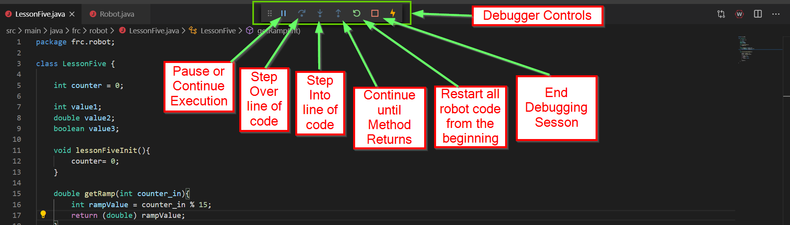
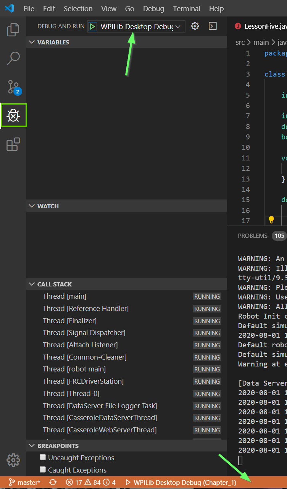
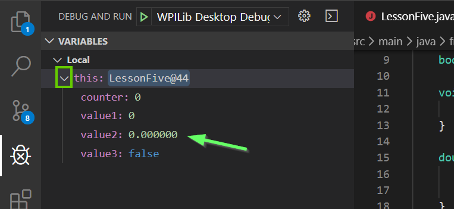
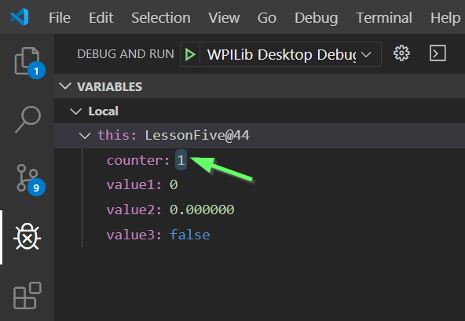
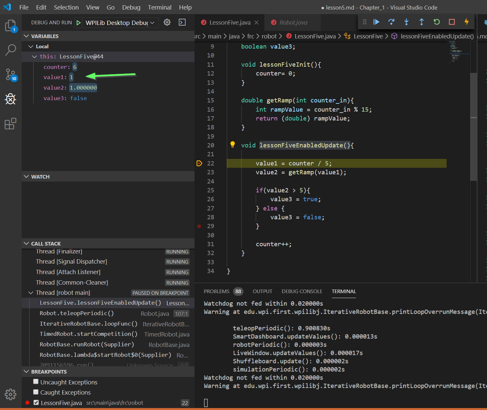
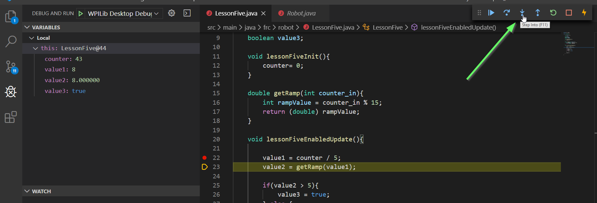
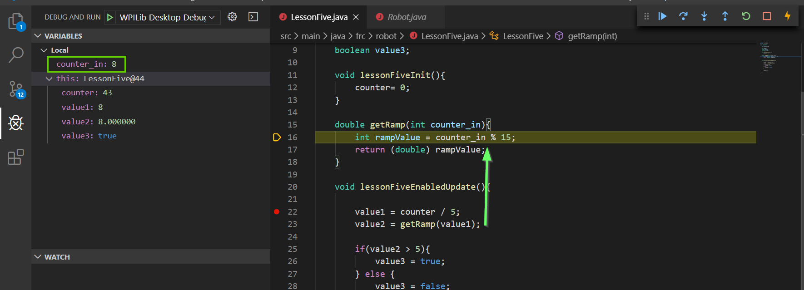

# Lesson 5.1 - Using the Debugger

The *debugger* is a tool which allows us to walk through our code's execution, line by line. As we step through code, we can inspect the values of different variables.

This is a useful tool for discovering bugs, and finding fixes.

We'll start by debugging code running on our desktops.

## Walk-Through

We'll walk through basic usage of the debugger that's available for robot code. 

Start by opening `LessonFive.java` in vsCode.

### Launching the Debugger

Press `F5` on your keyboard like normal, select the HAL sim GUI .dll, and let it run like normal. You should see the sim GUI pop up. The debugger is now running in the background.

The controls for the debugger are:

Click the "bug-with-an-X" on the left side of vsCode to open the debug pane:

The orange bar at the bottom of the window indicates debugging is active.

To run the lesson five code, put the robot into Teleop enabled mode.

### Setting Breakpoints

Click in the space to the left of the line numbers in a particular file. 

This sets a breakpoint.

Set a breakpoint on the first line of `lessonFiveEnabledUpdate()`.

Quick knowledge check: _Why isn't this function getting called?_ Check your answer below.

 Explanation 

The robot defaults to being in the Disabled state. In `Robot.java`, you can see that in `disabledPeriodic()`, there is indeed no call to `lessonFiveEnabledUpdate()`. Because of this, during the Disabled state, `lessonFiveEnabledUpdate()` should _NOT_ be getting called. The fact that the debugger does not hit this line of code while disabled proves this functionality. Huzzah!

Enable the robot in `Teleop` mode:

The breakpoint in `lessonFiveEnabledUpdate()` should be "hit":

Finally, you'll see the *Call Stack* in the bottom left. This shows not just where we're currently at in the code, but some info about _how we got here_. Specifically, you can see that `LessonFive.lelssonFiveEnabledUpdate()` (where we're at) got called from `Robot.teleopPeriodic()`, as expected. Below that, `Robot.teleopPeriodic()` got called from other code that's internal to WPIlib, and can be ignored.

### Viewing Variable Values

One of the main things you'll want to do while the code is stopped is to view the values that are presently stored in each variable. You can click the `>` character next to the `this` portion under the Variables window to expand out a list of all variables in the LessonFive class, and their values:

All are currently zero. This is because we haven't really run any code yet: Remember, we stopped on the first line of the first call to `lessonFiveEnabledUpdate()`. They're still all at their init values. Which, in this case, happens to be zero.

Go ahead and click the Continue (or "Play") button in the debugger controls. This will let the code continue to the next breakpoint. 

Since we only have one breakpoint in our `periodic` function, execution should continue through the rest of this loop, and stop at the beginning of the next.

You should see execution stop on that same line with the breakpoint again, but the variables have now changed values:

Congratulations! You've done the most basic form of debugging, which is extremely powerful! Merely the ability to stop code at a certain point and inspect variable values gives you vast opportunities to understand code behavior, and determine what sorts of things have gone right or wrong.

### Stepping through lines of code

Let's take the next _step_ (ha). We don't just have to set breakpoints every time we want to stop execution. Once stopped, we could instead step through lines of code, one by one, and inspect how variables have changed each time.

Presumably, your debugger is still up and running from before, at the start of `lessonFiveEnabledUpdate()`, with `counter` equal to `1`.

Go ahead and start clicking the "Step Over" button, one at a time, and watch how the yellow cursor moves through code.

Once you hit the end of the `lessonFiveEnabledUpdate()`, go ahead and hit the Continue (or play) button and let execution wrap back around to the start of the next loop.

Notice that counter is ticking up by one, every time you cross the `counter++;` statement (as you should expect).

However, value1, an integer, is getting set to zero usually (remember, integer division rounds down). This in turn yeilds the behavior you're seeing later on.

Keep hitting step-over or continue until counter equals six. Ah ha! Finally, some other values.

Step again over each line of code, and note how some different values are calculated.

#### Over vs. Into

One of the times while stepping through code, when you hit the line that has the call to `getRamp()`, try clicking the "Step Into" button.

Ah, nifty! This time, rather than _stepping over_ the call to `getRamp()`, we trace execution _into_ the method!

You can see in the bottom left how the call stack has one new thing on the top - `LessonFive.getRamp(int)` was called from `LessonFive.lessonFiveEnabledUpdate()`, again as expected.

You can see we also have a new variable visible, `counter_in`. This was our input argument. Step through the two lines of code, and past the end of this method. Notice how it returns to the previous call point.

Finally, when we're done, go ahead and click the red square in the Debugger Controls to stop the debug session.
