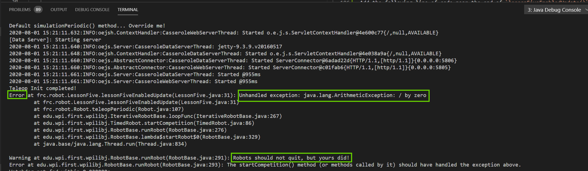

# Lesson 5.1 - Problem Solving with the Debugger

We've gone through plenty of examples showing how the debugger can be used to intercept code execution and analyze it. But, we've not done much yet in terms of _using_ it to solve a concrete problem.

Though the problems you'll see "in the wild" can be varied and complex, but all should be discoverable through these same set of techniques we introduced above.

## Basic Advice

Before we begin, read some general advice from [Harvard's CS161 course notes](https://www.eecs.harvard.edu/~cs161/resources/gdb.html)

### Tip 1: Check your beliefs about the program

So how do you actually approach debugging? When you have a bug in a program, it means that you have a particular belief about how your program should behave, and somewhere in the program this belief is violated. For example, you may believe that a certain variable should always be 0 when you start a "for" loop, or a particular pointer can never be NULL in a certain "if statement". To check such beliefs, set a breakpoint in the debugger at a line where you can check the validity of your belief. And when your program hits the breakpoint, ask the debugger to display the value of the variable in question.

### Tip 2: Narrow down your search

If you have a situation where a variable does not have the value you expect, and you want to find a place where it is modified, instead of walking through the entire program line by line, you can check the value of the variable at several points in the program and narrow down the location of the misbehaving code.

### Tip 3: Walk through your code

Steve Maguire (the author of "Writing Solid Code") recommends using the debugger to step through every new line of code you write, at least once, in order to understand exactly what your code is doing. It helps you visually verify that your program is behaving more or less as intended. With judicious use, the step, next and finish commands can help you trace through complex code quickly and make it possible to examine key data structures as they are built. 

With that in mind, let's try a problem-solving exercise.

## Problem Solving Exercise

Lets add a new line of code, and run with the debugger to see how to detect the error and correct for it.

Add the following code within, but near the end of, `lessonFiveEnabledUpdate()`:

```java
//Find ratio between values 1 and 2, as an integer.
int value12Ratio = (int) value2 / value1;
```

Remove any existing breakpoints, we won't need them just yet.

Now, go run the code, and enable in teleop. What's happening? The program stops running as soon as you go to teleop! Whaaaa....

The actual error that caused java to give up shows up in the log console:



There's a couple things to note here:

`Error` is the main indicator that something is wrong. The description `Unhandled Exception` and `/ by zero` should start to give you some hints as to what was wrong.

`LessonFiveEnabledUpdate` points to our new line of code we just added, which makes sense (since the code was just working, and that was the _only_ thing we changed).

Finally, as indicated by the error message, `Robots should not quit, but yours did!`. This warning is real - if we were to do this on the field, we'd be stuck dead in the water for a solid 30 seconds until everything rebooted. Definitely bad, and needs fixed.

Now, the astute student might be looking at our new line of code, and know what went wrong right away. Regardless of whether you think you know the answer, let's hook up the debugger to at least confirm.

Since we know the line of code where the error happened, let's put a breakpoint on it. This should stop program execution right before the error happens.

Place the breakpoint and re-run, enabling in teleop.

We should now stop right on the line, before an error happens. Inspect the variable values. Which variables are involved in this line of code?

Hopefully, `value1` catches your eye. On this first loop, it has a value of `0`. This, as you would probably expect, does not work well when used in the denominator of a division operation. You can hit continue - it should produce the same error we saw earlier.

You have determined root cause of the problem, excellent! But now what?

Usually, for something like this, you have to go back to the drawing board. We knew we wanted to calculate the ratio between values 1 and 2.... but we forgot `value1` sometimes goes to zero. Huh. 

For the sake of this exercise, let's assume the following: If `value1` is zero, just set the ratio to zero as well. Otherwise, calcualte it as normal.

Add some new code with `if`/`else` statements to perform this operation. Walk through your new code line by line and verify it works for cases where value1 is both zero and nonzero.

