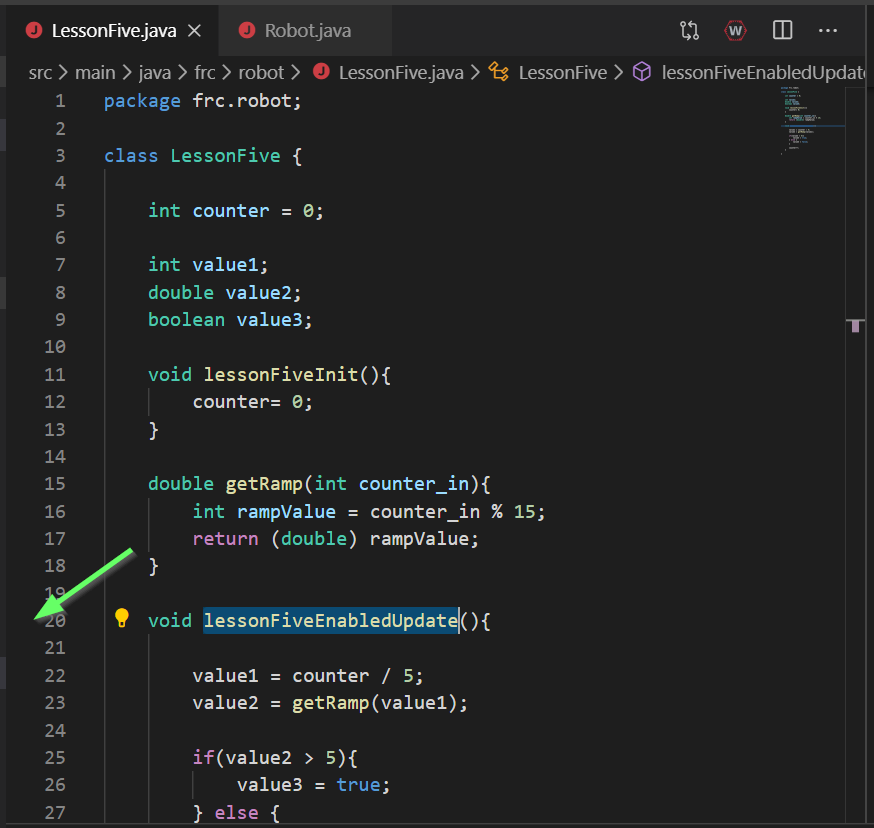
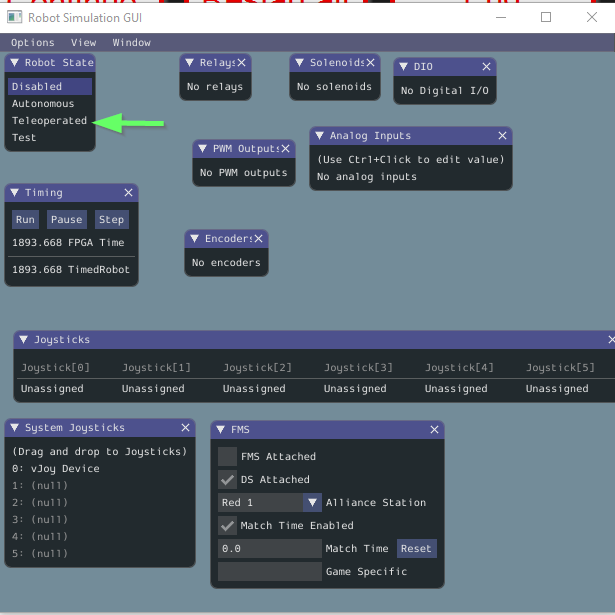
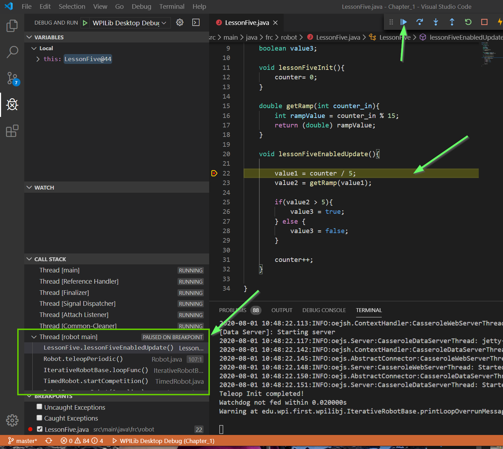

# Lesson 5 - Using the Debugger

## Some Thoughts Before We Begin

Don Knuth is one of the great pioneers of software engineering. He once stated something very true: 

_Software is, first and foremost, meant to be read by human beings. Only incidentally does it get executed by a machine._

This is something that is good to keep in mind for any software writing, but especially when writing code in a team environment. The software is intended to _communicate to other team members_ what your _intent_ for the robot's functionality is. It just so happens we use this "java" thing to express that intent, so that the robot can eventually run that software too.

Intent is best-expressed by:

1) Choosing good, meaningful names for your variables and methods.
2) Applying liberal code comments to explain the "why" 
3) Keeping "like" code in one spot (ie: Don't put arm code into the shooter.java file)
4) Splitting out code into meaningful sub-chunks (ie: break long segements of code into methods with cohesive outcomes)
5) Don't Repeat Yourself (DRY) (ie: use methods to re-use code chunks, don't copy-paste)

The good news is you've already learned most of the organizational tools needed to write good code. The bad news is that it still takes practice to become proficient at using those tools. But fear not! The very fact you are reading this means you're already on the path to becoming more proficient! Keep up the hard work, and you'll be amazed where it will take you!

## The Debugger

Up till now, the pieces of code we've written are pretty small. Small enough that _by just staring at the code_, you can probably predict how it will work.

Ideally, as we write more and more code, we'll keep it as organized as possible, to help keep this "inspectability". However, inevitably, bigger projects create more complex problems, that need more advanced tools to unravel.

We've already looked at one of these tools: inserting `System.out.println()` calls at critical portions of your code allow you to check multiple things. This includes order of execution, and values of variables at various times.

You've also seen the website utilities, which allow you to see values of variables as they change over time.

We will introduce one additional tool that you can use to help investigate problems. It's called the _single step debugger_, or simply the "debugger".

The debugger allows you to stop code execution on certain lines, "step" through your code's execution line by line, and print out values of variables and expressions at runtime. The biggest advantage of the debugger is that it doesn't require injecting any additional lines of code into your software - it _just works_. (usually :D).

When running code locally on a desktop, the debugger is automatically running in the background - nothing special you have to do to start it.

Regardless of what debug tool you happen to be using, the technique for solving problems is generally the same:

1) Look at the code, and decide how you are expecting it to work.
2) Investigate the code as it executes from start to end.
3) Find the first place where the behavior of the code deviates from your expectations.

The important thing to keep in mind: When you see errors, or software that doesn't work like you'd expect, don't get discouraged! There is a solution, it will just take time and technique to find it. Practicing this technique, over and over again, is how you get better and better at creating software!

## Walk-Through

We'll now walk you through basic usage of the debugger that's available for robot code. 

The same debugger can be used to inspect code behavior on both the robot and on your desktop. We'll start by debugging code running on our desktops.

Start by opening `LessonFive.java` in vsCode.

### Launching the Debugger

The debugger is automatically enabled when running software on your PC. Just press `F5` on your keyboard like normal, select the HAL sim GUI .dll, and let it run. You should see the sim GUI pop up. The debugger is now running in the background, ready to be used to analyze code behavior!

You've probably seen the controls before, but here's the more detailed explanation of what each button does:

Additionally, click the "bug-with-an-X" on the left side of vsCode to open the debug pane:

The orange bar at the bottom of the window indicates debugging is active right now (blue indicates nothing is running). Additionally, you can see that we launched the `Desktop Debug` routine, as expected.

Take a quick look at the code in the  `LessonFive` class. You can see it has a method named `lessonFiveEnabledUpdate()`, which is getting called inside `Robot.java`'s `teleopPeriodic()` method. Therefor, to "active" or "run" the lesson five code, we know we'll need to have the robot in the Teleop enabled mode.

### Setting Breakpoints

Remember that a computer executes a program line by line, starting at the top, going through method calls as needed, calculating and assigning values for each line, then moving on to the next line.

A "breakpoint" is a flag sent to the program to tell it to stop execution once code reaches the start of a certain line. "Setting" a breakpoint is the act of setting that flag on a particular line of code.

To set a breakpoint in vsCode, simply click in the space to the left of the line numbers in a particualr file. 

Let's go ahead and do this on the first line of `lessonFiveEnabledUpdate()`.

There should be a bright red circle that appears next to the line. Nothing else will happen at this point, because we're _not yet calling this method_.

Quick knowledge check: _Why isn't this function getting called?_ Check your answer below.

 Explanation 

The robot defaults to being in the Disabled state. In `Robot.java`, you can see that in `disabledPeriodic()`, there is indeed no call to `lessonFiveEnabledUpdate()`. Because of this, during the Disabled state, `lessonFiveEnabledUpdate()` should _NOT_ be getting called. The fact that the debugger does not hit this line of code while disabled proves this functionality. Huzzah!

With our breakpoint set, let's go ahead and enable the robot code. Do this by selecting `Teleooperated` from the `Robot State` pane in the Robot Simulation GUI:

As soon as you do this, `lessonFiveEnabledUpdate()` will get called, and we should _hit the breakpoint_. Here's what that looks like:

The most obvsious indicator is the yellow highlights on the breakpoint and line. It indicates the program is currently stopped on this line of code.

You'll additionally see our previous "Pause" icon in the debugger controlls has changed to a play button. Since the code is now stopped, we have a few options for what we can do, including continuing execution until the next breakpoint.

Finally, you'll see the *Call Stack* in the bottom left. This shows not just where we're currently at in the code, but some info about _how we got here_. Specifically, you can see that `LessonFive.lelssonFiveEnabledUpdate()` (where we're at) got called from `Robot.teleopPeriodic()`, as expected. Below that, `Robot.teleopPeriodic()` got called from other code that's internal to WPIlib, and can be ignored.

### Viewing Variable Values

One of the main things you'll want to do while the code is stopped is to view the values that are presently stored in each variable. You can click the `>` character next to the `this` portion under the Variables window to expand out a list of all variables in the LessonFive class, and their values:

All are currently zero. This is because we haven't really run any code yet: Remember, we stopped on the first line of the first call to `lessonFiveEnabledUpdate()`. They're still all at their init values. Which, in this case, happens to be zero.

Go ahead and click the Continue (or "Play") button in the debugger controls. This will let the code continue to the next breakpoint. 

Since we only have one breakpoint in our `periodic` function, execution should continue through the rest of this loop, and stop at the beginning of the next.

You should see execution stop on that same line with the breakpoint again, but the variables have now changed values:

Congradulations! You've done the most basic form of debugging, which is extremely powerful! Meerly the ability to stop code at a certain point and inspect variable values gives you vast opportunities to understand code behavior, and determine what sorts of things have gone right or wrong.

### Stepping through lines of code

Let's take the next _step_ (ha). We don't just have to set breakpoints every time we want to stop execution. Once stopped, we could instead step through lines of code, one by one, and inspect how variables have changed each time.

Presumably, your debugger is still up and running from before, at the start of `lessonFiveEnabledUpdate()`, with `counter` equal to `1`.

Go ahead and start clicking the "Step Over" button, one at a time, and watch how the yellow cursor moves through code.

Once you hit the end of the `lessonFiveEnabledUpdate()`, go ahead and hit the Continue (or play) button and let execution wrap back around to the start of the next loop.

Notice that counter is ticking up by one, every time you cross the `counter++;` statement (as you should expect).

However, value1, an integer, is getting set to zero usually (remember, integer division rounds down). This in turn yeilds the behavior you're seeing later on.

Keep hitting step-over or continue until counter equals six. Ah ha! Finally, some other values.

Step again over each line of code, and note how some different values are calculated.

#### Over vs. Into

One of the times while stepping through code, when you hit the line that has the call to `getRamp()`, try clicking the "Step Into" button.

Ah, nifty! This time, rather than _stepping over_ the call to `getRamp()`, we trace execution _into_ the method!

You can see in the bottom left how the call stack has one new thing on the top - `LessonFive.getRamp(int)` was called from `LessonFive.lessonFiveEnabledUpdate()`, again as expected.

You can see we also have a new variable visible, `counter_in`. This was our input argument. Step through the two lines of code, and past the end of this method. Notice how it returns to the previous call point.

Finally, when we're done, go ahead and click the red square in the Debugger Controls to stop the debug session.

### Problem Solving

We've gon through plenty of examples showing how the debugger can be used to intercept code execution and analyze it. But, we've not done much yet in terms of _using_ it to solve a concrete problem.

Though the problems you'll see "in the wild" will be varied and 

Here's what we expect the code to do. Step through it. Observe it doesn't do it. Use debugger to figure out why. Change code so it does do it. Test.

Problem.... maybe a misnaming between variables?

Some general advice from [Harvard's CS161 course notes](https://www.eecs.harvard.edu/~cs161/resources/gdb.html)

#### Tip 1: Check your beliefs about the program

So how do you actually approach debugging? When you have a bug in a program, it means that you have a particular belief about how your program should behave, and somewhere in the program this belief is violated. For example, you may believe that a certain variable should always be 0 when you start a "for" loop, or a particular pointer can never be NULL in a certain "if statement". To check such beliefs, set a breakpoint in the debugger at a line where you can check the validity of your belief. And when your program hits the breakpoint, ask the debugger to display the value of the variable in question.

#### Tip 2: Narrow down your search

If you have a situation where a variable does not have the value you expect, and you want to find a place where it is modified, instead of walking through the entire program line by line, you can check the value of the variable at several points in the program and narrow down the location of the misbehaving code.

#### Tip 3: Walk through your code

Steve Maguire (the author of Writing Solid Code) recommends using the debugger to step through every new line of code you write, at least once, in order to understand exactly what your code is doing. It helps you visually verify that your program is behaving more or less as intended. With judicious use, the step, next and finish commands can help you trace through complex code quickly and make it possible to examine key data structures as they are built. 

